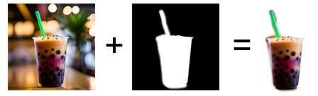

# SVG Masker

## TLDR

Use a black and white jpeg image as a mask for another jpeg and save it as SVG

## Overview

Combine two jpeg images in to a single SVG, using one of the images as the alpha mask for the other. On the mask image, the darker the black, the more transparent.
The output SVG will include both jpegs encoded in base64, so you can use the generated file as a somewhat smaller alternative to a PNG, where you need to mask a photo.

## Usage

Select the base image and the mask, then click Ok
